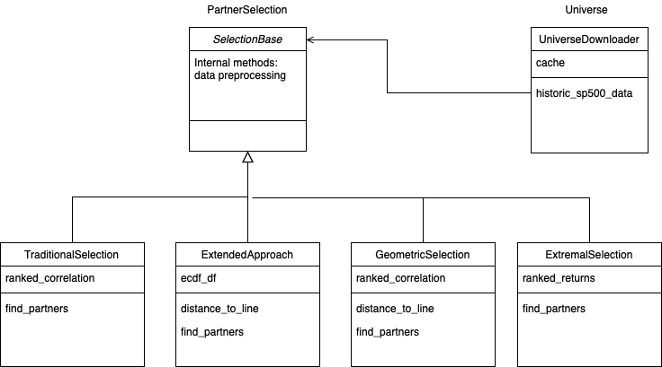

The vinecopulaslab is a basic implementation of the paper [Statistical Arbitrage with Vine Copulas [Stübinger, Mangold, Krauss (2016)]](https://www.econstor.eu/bitstream/10419/147450/1/870932616.pdf)

Its purpose is to find correlated stock partners for statistical arbitrage

For installation currently you can only use git clone

Afterwards you can access the tutorial ipynb

The requirements are mainly numpy, pandas.
The work was done in effort for the application of the march apprenticeship of Hudson & Thames

